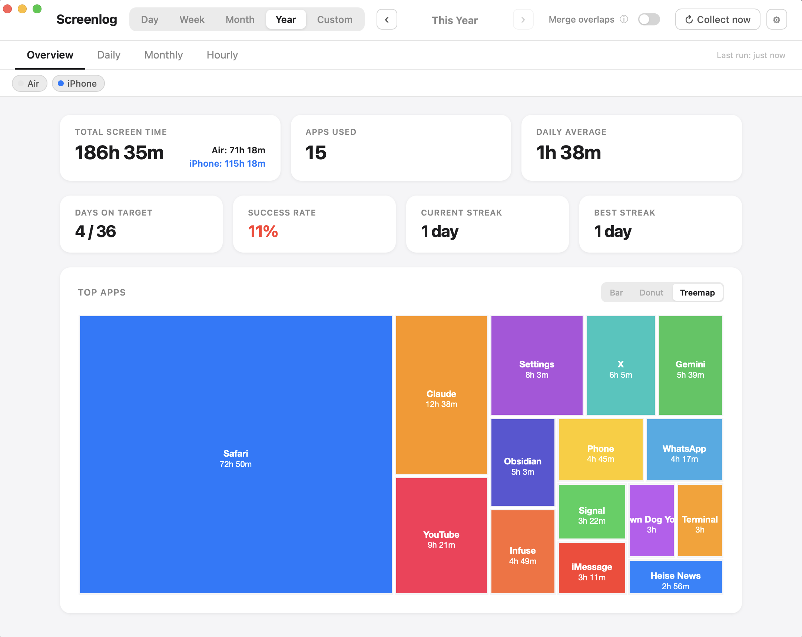
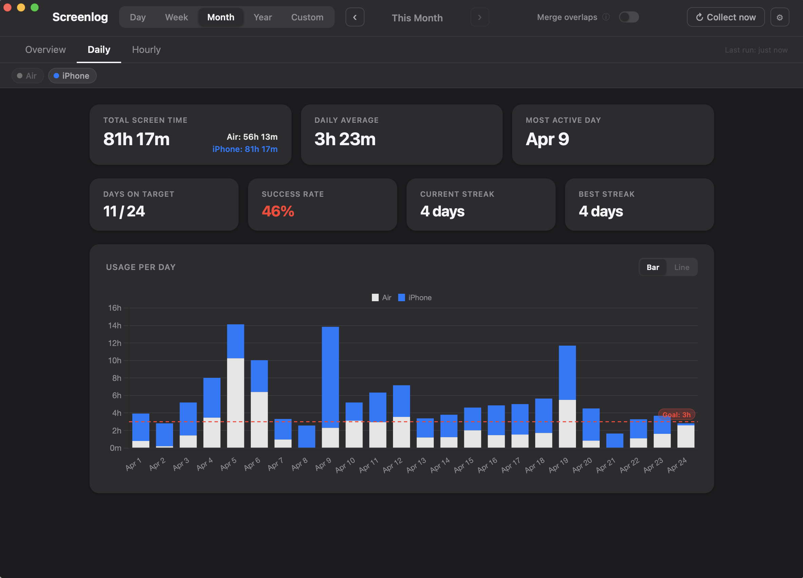
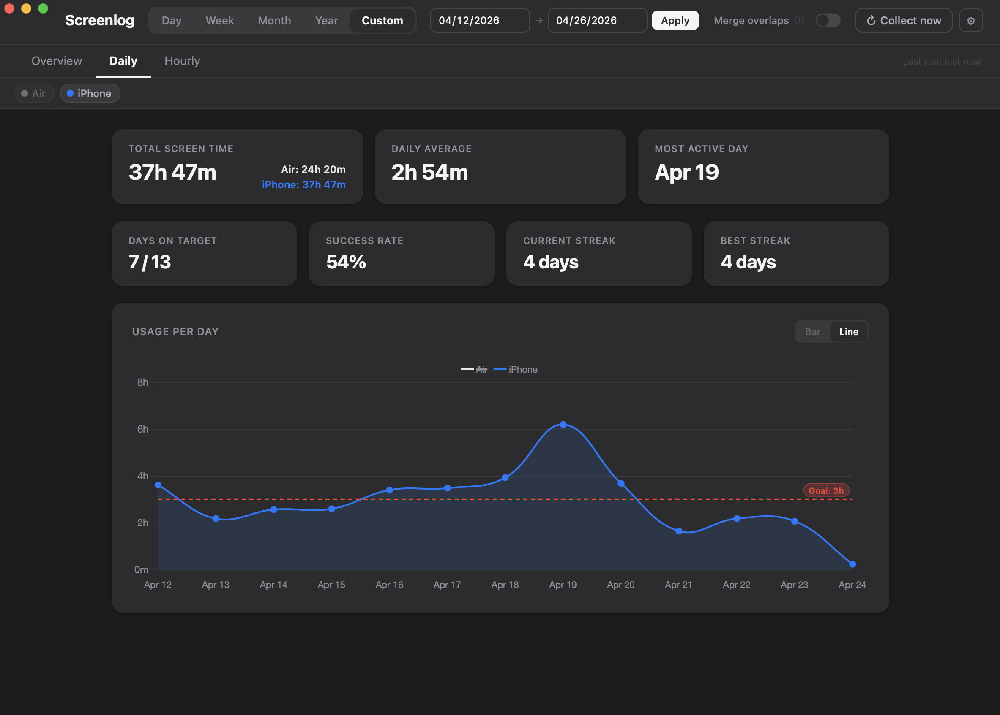
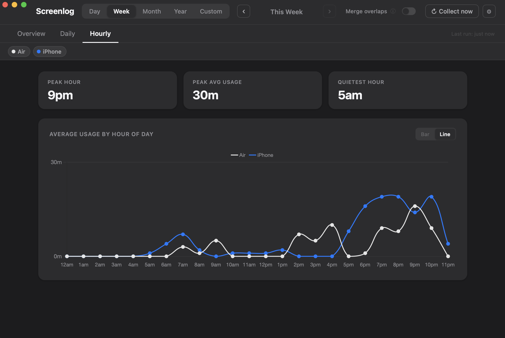
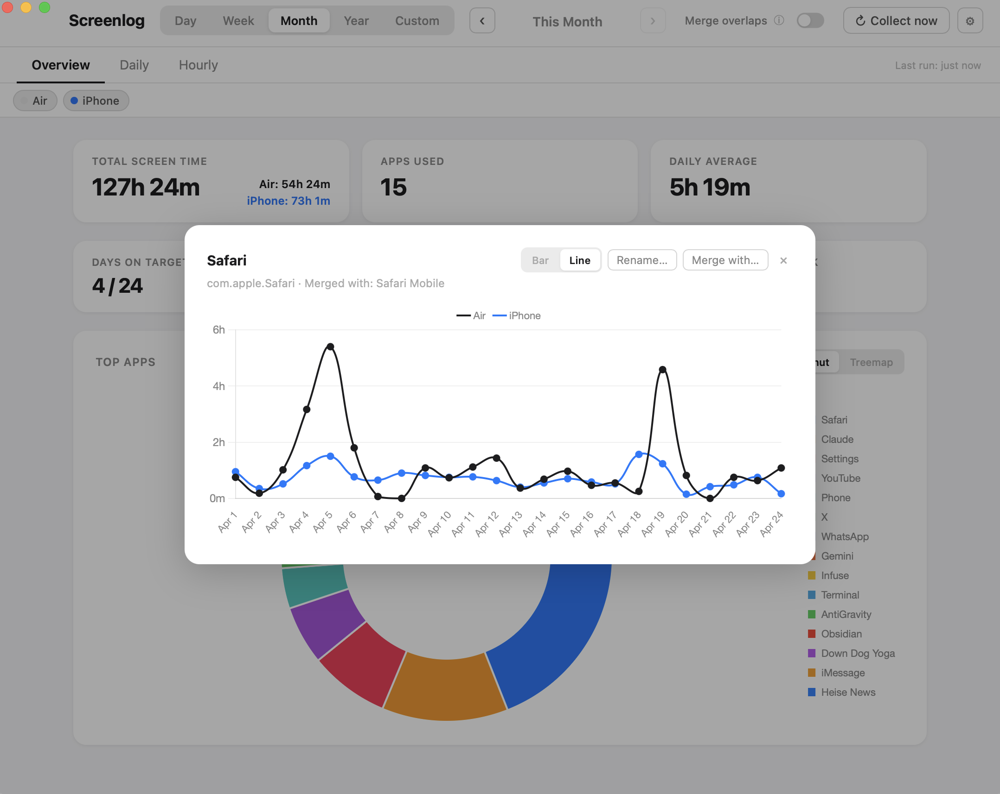
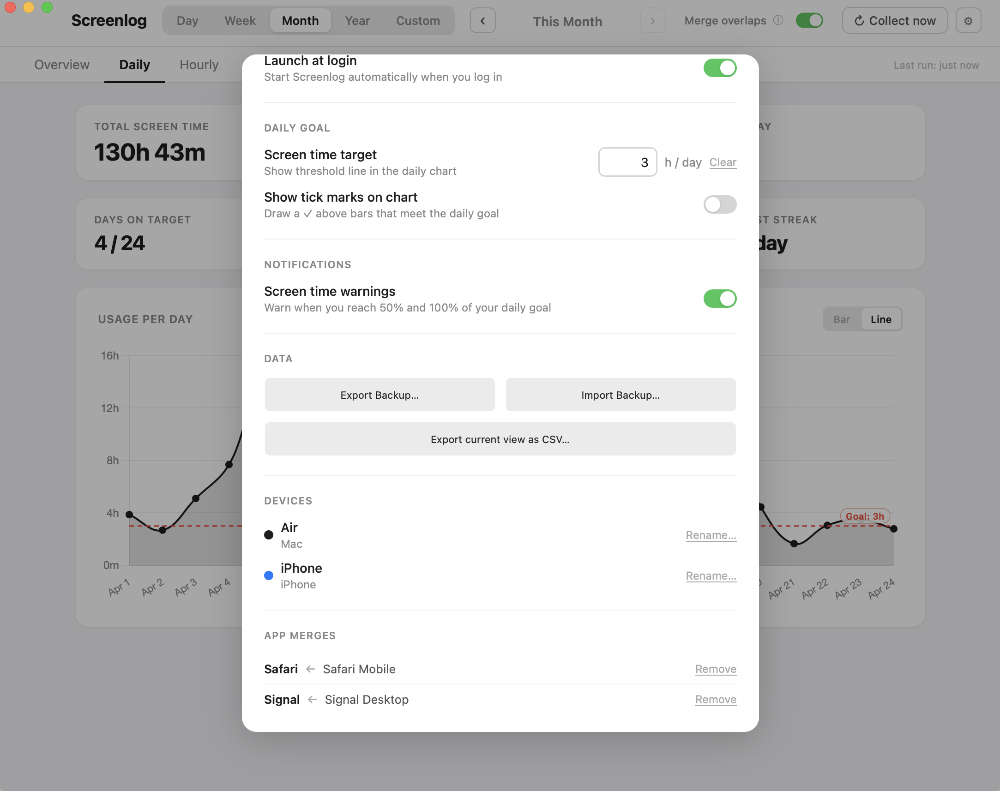

# Screenlog

A lightweight macOS menu bar app that visualises your Screen Time data.
No cloud, no Python, no server — everything stays on your Mac.

Built with [Tauri v2](https://tauri.app) (Rust backend + system WKWebView). The entire app bundle is **~6 MB**.

## Screenshots

<table>
  <tr>
    <td></td>
    <td></td>
  </tr>
  <tr>
    <td></td>
    <td></td>
  </tr>
  <tr>
    <td></td>
    <td></td>
  </tr>
</table>

## Why Screenlog instead of the built-in Screen Time app?

macOS has a Screen Time panel in System Settings, but it is designed for parental controls and gives you almost no analytical power as a regular user:

- **No history beyond a week** — you cannot look back more than 7 days
- **No daily goal tracking** — no threshold line, no streak, no success rate
- **No notifications** — it won't warn you when you are halfway through your daily budget
- **No data export** — you cannot get your usage data out in any form
- **No per-app history** — you can't see how a single app's usage has changed over time
- **No menu bar access** — you have to dig into System Settings every time

Screenlog reads the same underlying database that macOS populates, adds its own lightweight storage layer, and surfaces everything in a persistent menu bar dashboard.

## Features

- **Menu bar app** — no Dock icon; click the tray icon to show or hide the window
- **Automatic collection** — gathers data on startup, every hour, and on every wake from sleep
- **Multi-device** — Mac, iPhone, and iPad usage shown together with per-device colours; click device pills to hide individual devices from charts
- **Merge overlaps** — header toggle that deduplicates simultaneous multi-device usage so time is never counted twice
- **Daily goal** — set a target in hours; a threshold line appears on the chart and KPI cards track your success rate and streak
- **Screen time warnings** — optional notifications at 50% and 100% of your daily goal
- **App drill-down** — click any bar in the Overview to see that app's full daily history, coloured by device
- **App renaming** — give any app a friendlier display name
- **Export** — back up the database or export the current view as CSV
- **Dark mode** — follows system appearance, or force Light / Dark in Settings
- **Launch at login** — optional, configured in Settings
- **Secure** — reads Apple's database read-only, all data stays local

## Requirements

- macOS 12 (Monterey) or later
- Rust + `@tauri-apps/cli` (build from source only)

## Install

### Download (recommended)

Download the latest `Screenlog-*.dmg` from [Releases](../../releases), open it, and drag **Screenlog.app** to your Applications folder.

> **First launch:** macOS will show _"Screenlog cannot be verified"_ because the app is not notarised.
> To open it: **right-click → Open**, then click **Open** in the dialog.
> After that it launches normally. Alternatively, run:
> ```bash
> xattr -cr /Applications/Screenlog.app
> ```

### Build from source

```bash
git clone https://github.com/r-erd/screenlog.git
cd screenlog
npm install          # installs @tauri-apps/cli
npm run build        # compiles the Rust backend + bundles the app
```

The built app will be at `src-tauri/target/release/bundle/macos/Screenlog.app`.

> **Rust required.** If you don't have Rust installed:
> ```bash
> curl --proto '=https' --tlsv1.2 -sSf https://sh.rustup.rs | sh
> source ~/.cargo/env
> ```

## First launch

On first launch, Screenlog shows a setup screen asking for **Full Disk Access**.

Apple's Screen Time database (`~/Library/Application Support/Knowledge/knowledgeC.db`) is protected by macOS privacy controls. Full Disk Access is required to read it.

1. Click **Open System Settings** in the app
2. Go to **Privacy & Security → Full Disk Access**
3. Enable access for **Screenlog**
4. Click **Check Again** in the app

## Usage

### Daily goal & notifications

Open **Settings** (⚙) and enter a target in hours under **Daily Goal**. Once set:
- A red dashed **threshold line** appears on the Daily chart
- **✓ tick marks** appear above bars that meet the goal (toggle in Settings)
- Four **KPI cards** show days on target, success rate, and streaks
- Enable **Screen time warnings** in Settings → Notifications to get notified at 50% and 100% of your goal

### App drill-down

In the Overview chart, **single-click** any bar to open a daily history chart for that app. **Double-click** to rename it.

### Settings (⚙)

| Section | Options |
|---------|---------|
| **Appearance & System** | Light / Dark / System appearance; Launch at login |
| **Daily Goal** | Set or clear a daily screen time target; toggle tick marks |
| **Notifications** | Screen time warnings at 50% and 100% of goal |
| **Data** | Export DB backup, import backup, export current view as CSV |
| **Devices** | List of devices with data; rename any device |
| **Grafana Push** | Push data to a PostgreSQL database for Grafana dashboards |
| **Collection History** | Log of every collection run with row counts and errors |

## iPhone & iPad data

Screenlog reads iPhone and iPad screen time from **Apple Biome** — a local cache of iCloud-synced data stored at `~/Library/Biome/`. This requires Full Disk Access (same permission needed for Mac data) and works on macOS 13+.

To get iPhone/iPad data:

1. On your iPhone/iPad: **Settings → Screen Time → Share Across Devices** → enable it
2. Make sure iCloud sync has had time to push data to your Mac (usually within minutes)
3. Click **Collect now** in Screenlog — iPhone and iPad usage will appear in the charts

Each physical device appears as a separate colour in the charts. You can rename devices in **Settings → Devices**.

**Device filter pills** appear below the tabs when data from multiple devices is present. Click any pill to hide that device from all charts; click again to bring it back.

**Merge overlaps** (toggle in the header) deduplicates minutes where multiple devices were active simultaneously. When enabled, device pills are hidden and every chart shows a single merged total — useful if you often have your iPhone and Mac open at the same time.

## Grafana integration

Screenlog can push daily screen time totals to a PostgreSQL database so you can build Grafana dashboards on top of your data.

### Prerequisites

- A running PostgreSQL instance reachable from your Mac (e.g. a home server)
- A Grafana instance with the **PostgreSQL data source** plugin (built-in, no extra install needed)

### 1 — Create a database and user on your PostgreSQL server

```sql
CREATE DATABASE screenlog;
CREATE USER screenlog WITH PASSWORD 'your-password';
GRANT ALL PRIVILEGES ON DATABASE screenlog TO screenlog;

-- PostgreSQL 15+: also grant schema privileges
\c screenlog
GRANT ALL ON SCHEMA public TO screenlog;
```

### 2 — Configure Screenlog

Open **Settings → Grafana Push** and fill in:

| Field | Example |
|-------|---------|
| Host | `homeserver.local` |
| Port | `5432` |
| Database | `screenlog` |
| User | `screenlog` |
| Password | `your-password` |

Click **Test connection** to verify, then **Push all data** to do the initial sync. Enable **Auto-push after collection** to keep Grafana up to date automatically.

Screenlog creates the table automatically on first push:

```sql
CREATE TABLE screenlog_daily (
    day         DATE   NOT NULL,
    app         TEXT   NOT NULL,
    device_id   TEXT   NOT NULL DEFAULT '',
    device_type TEXT   NOT NULL DEFAULT 'mac',   -- mac | iphone | ipad
    device_name TEXT   NOT NULL DEFAULT 'Mac',
    usage_secs  BIGINT NOT NULL DEFAULT 0,
    PRIMARY KEY (day, app, device_id)
);
```

### 3 — Add the data source in Grafana

1. **Connections → Data sources → Add new data source → PostgreSQL**
2. Set **Host URL** to your PostgreSQL address (e.g. `homeserver.local:5432`)
3. Set **Database**, **User**, **Password** as above
4. Set **TLS/SSL Mode** to `disable` (unless your Postgres has TLS configured)
5. Click **Save & test**

### 4 — Example dashboard queries

**Total daily screen time (hours):**
```sql
SELECT
  day AS "time",
  SUM(usage_secs) / 3600.0 AS "Total hours"
FROM screenlog_daily
WHERE $__timeFilter(day::timestamp)
GROUP BY day
ORDER BY day
```

**Top apps for the selected period:**
```sql
SELECT
  app,
  SUM(usage_secs) / 60 AS "Minutes"
FROM screenlog_daily
WHERE $__timeFilter(day::timestamp)
GROUP BY app
ORDER BY 2 DESC
LIMIT 20
```

**Usage split by device type:**
```sql
SELECT
  day AS "time",
  device_name,
  SUM(usage_secs) / 3600.0 AS "Hours"
FROM screenlog_daily
WHERE $__timeFilter(day::timestamp)
GROUP BY day, device_name
ORDER BY day
```

> **Time series panels:** set the panel type to **Time series**, enable **Format → Table** for the top-apps query.

## How it works

macOS continuously writes Screen Time data to `~/Library/Application Support/Knowledge/knowledgeC.db`. Screenlog reads from that database (read-only, never writes), stores records in its own database at `~/Library/Application Support/com.screenlog.dashboard/screentime.db`, and displays them in the dashboard.

Collection runs on startup, every hour, and on every wake from sleep.

## Creating a release

1. Update `"version"` in `src-tauri/tauri.conf.json`
2. Commit and push to main
3. Tag the commit and push the tag:
   ```bash
   git tag v1.2.0
   git push origin v1.2.0
   ```
4. GitHub Actions builds the DMG and publishes it as a GitHub Release automatically.

## Security

- `knowledgeC.db` is opened **read-only** — the app never writes to Apple's database
- Renderer runs in a sandboxed WKWebView — no Node.js access
- Content Security Policy blocks all external network requests
- Chart.js is bundled locally — nothing is loaded from a CDN
- All data stays on your Mac

## Privacy

All data stays on your Mac by default. Nothing is sent anywhere unless you explicitly configure and trigger the optional **Grafana Push** feature, which sends data only to the PostgreSQL server you specify.
